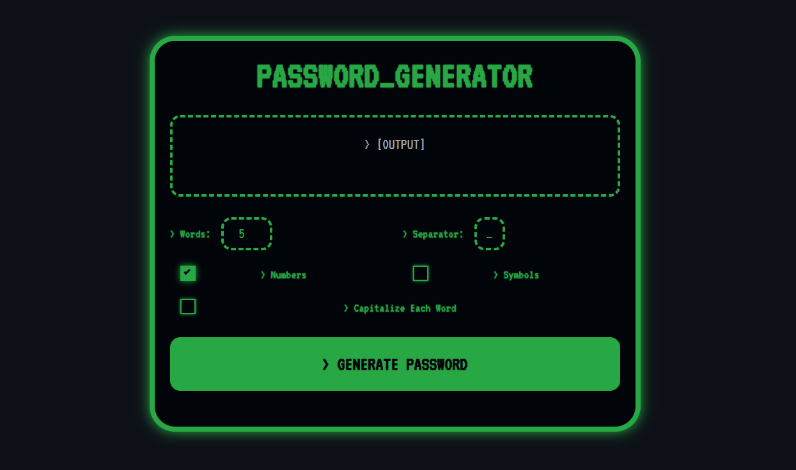

<p align="center">
  <a href="https://dochertydev.github.io/Password-Generator/">
    
  </a>
</p>

<h1 align="center">
Password Generator
</h1>

<h2 align="center">A retro-styled terminal password generator that creates memorable yet secure passwords.</h2>

<div align="center">

[](LICENSE) [](https://dochertydev.github.io/Password-Generator/) [](https://github.com/DochertyDev/Password-Generator)

</div>

:star: _Love Password Generator? Give us a star to help other developers discover it!_

<br />

<div>

</div>

>**New!**
>Now with a real-time password strength indicator and custom separators!

---

## 📋 Table of Contents

- [Overview](#-overview)
- [Quick Start](#-quick-start-local-development)
- [Usage](#️-usage)
- [Technologies Used](#️-technologies-used)
- [Security Notes](#-security-notes)
- [Troubleshooting](#-troubleshooting)
- [Contributing](#-contributing)
- [Support the Project](#-support-the-project)
- [Disclaimer](#️-disclaimer)

## 📄 Overview

A retro-styled terminal password generator that creates memorable yet secure passwords using random word combinations. This is a single-page application built with HTML, Tailwind CSS, and vanilla JavaScript.

- **Customizable Passwords:** Adjust the number of words (from 1 to 10).
- **Add Complexity:** Optionally include numbers, symbols, and capitalize each word.
- **Custom Separator:** Define a custom character to separate the words (e.g., `_`, `-`, `.`).
- **Secure Generation:** Uses the `window.crypto` API for cryptographically secure random values.
- **Strength Indicator:** Real-time feedback on password strength (Weak, Medium, Strong).
- **Copy to Clipboard:** Easily copy the generated password with a single click.
- **Retro Aesthetic:** A fun, "hacker terminal" interface with a monospace font and green-on-black text.

### 🚀 Quick Start (Local Development)

No build process or installation is required. To run the project locally:

1.  Clone the repository:
    ```sh
    git clone https://github.com/DochertyDev/Password-Generator.git
    ```
2.  Navigate to the project directory:
    ```sh
    cd Password-Generator
    ```
3.  Open the `index.html` file in any modern web browser.

## ⚙️ Usage

1.  **Navigate to the [Page URL](https://dochertydev.github.io/Password-Generator/)**.
2.  **Adjust the Options:**
    - **Words:** Set the number of words for your password.
    - **Separator:** Enter the character to place between words.
    - **Numbers:** Check this box to add a two-digit number to each word.
    - **Symbols:** Check this box to add a special character to each word.
    - **Capitalize:** Check this box to capitalize the first letter of each word.
3.  **Generate:** Click the `> GENERATE PASSWORD` button.
4.  **Copy:** The new password will appear in the output field. Click the `[COPY]` button to copy it to your clipboard.

## 🛠️ Technologies Used

-   **HTML5**
-   **Tailwind CSS** (via CDN)
-   **JavaScript (ES6+)**
-   **Google Fonts** (VT323)

## 🔒 Security Notes

The password generator utilizes the `window.crypto` API for generating cryptographically secure random values, which is essential for creating strong and unpredictable passwords. As a client-side application, generated passwords are not transmitted or stored on any server, enhancing user privacy and security. Users are advised to practice good password hygiene, such as using unique passwords for different services and storing them securely.

## ❓ Troubleshooting

This is a client-side, static web application with no complex dependencies or backend. Therefore, extensive troubleshooting is generally not required.

**Issue**: The application does not load or function correctly.
- **Solution**: Ensure you are opening the `index.html` file directly in a modern web browser. Clear your browser's cache if issues persist. Verify that JavaScript is enabled in your browser settings.

## 🤝 Contributing

<div align="center">
<a href="https://github.com/DochertyDev/Password-Generator/graphs/contributors">
  
</a>
</div>

We welcome contributions from the community! If you have suggestions for improvements or new features, feel free to open an issue or submit a pull request.

## 🌟 Support the Project

**Love Password Generator?** Give us a ⭐ on GitHub!

<div align="center">
  <p>
      
  </p>
</div>

## ⚠️ Disclaimer

This password generator is provided "as is" without any warranties, express or implied. While efforts have been made to ensure its security and functionality, the developers are not responsible for any direct or indirect damages or losses arising from its use. Users are solely responsible for the security of the passwords they generate and how they choose to use and store them.
